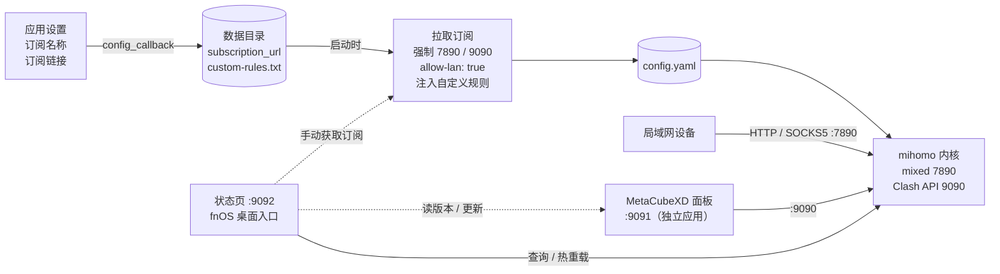

<div align="center">

# Mihomo Core（mihomo-core-fnos）

**把 mihomo（Clash Meta）内核装进飞牛 fnOS：开机自启的局域网代理，应用设置里填订阅即可用，状态页一键热更新内核**

[](https://github.com/techysy/mihomo-core-fnos/releases/latest)
[](https://github.com/techysy/mihomo-core-fnos/releases)
[](#下载)
[](https://www.python.org/)
[](LICENSE)

[下载](#下载) · [功能](#功能) · [快速开始](#快速开始) · [配置与订阅](#配置与订阅) · [状态页 API](#状态页-api) · [更新日志](CHANGELOG.md) · [使用说明](docs/USER-GUIDE.md)


</div>

独立的 mihomo 内核代理服务，作为 fnOS 应用随系统自启；节点切换、测速、连接查看交给 [MetaCubeXD 面板](https://github.com/techysy/metacubexd-fnos)（单独的 fnOS 应用）。

| 端口 | 用途 |
| --- | --- |
| `7890` | 混合代理（HTTP / SOCKS5），局域网设备的代理出口 |
| `9090` | Clash API（控制端），供 MetaCubeXD 面板连接 |
| `9092` | 自带状态页（fnOS 桌面入口）+ 局域网 API |

## 下载

从 [**Releases**](https://github.com/techysy/mihomo-core-fnos/releases/latest) 下载与 NAS 架构对应的 fpk：

| 平台 | 文件 | 说明 |
| --- | --- | --- |
| 飞牛 fnOS x86（Intel / AMD） | `mihomo-core-<版本>-x86.fpk` | url 版：桌面图标在浏览器新标签页打开状态页 |
| 飞牛 fnOS x86（Intel / AMD） | `mihomo-core-<版本>-iframe-x86.fpk` | iframe 版：状态页嵌在 fnOS 桌面窗口里 |
| 飞牛 fnOS ARM（aarch64） | `mihomo-core-<版本>-arm.fpk` | url 版 |
| 飞牛 fnOS ARM（aarch64） | `mihomo-core-<版本>-iframe-arm.fpk` | iframe 版 |

> url 版与 iframe 版功能完全相同，只是桌面入口的打开方式不同，二选一安装即可。
> 安装包内的 mihomo 内核、`geoip.metadb`、`geosite.dat` 均为构建时 MetaCubeX 上游的最新版。v1.1.2 及更早版本只有 x86 包，文件名为 `mihomo-core-<版本>.fpk` / `mihomo-core-<版本>-iframe.fpk`。
> 原标注适用于 fnOS 1.1.31xx 及以上；`manifest` 未声明最低系统版本，应用中心不会据此拦截安装。

## 架构



- **mihomo-core**（本应用）：运行 mihomo 内核，提供代理（7890）和控制 API（9090），附带状态页（9092）
- **MetaCubeXD**（[metacubexd-fnos](https://github.com/techysy/metacubexd-fnos)，单独安装）：纯前端面板，连接 9090 切换节点 / 测延迟 / 看连接

## 功能

**内核服务**
- **开机自启**：mihomo 内核作为 fnOS 应用服务运行，`cmd/main` 负责启动、停止、状态检测；启动后最多等待 20 秒确认 9090 就绪
- **规则数据预置**：安装包自带 `geoip.metadb` 与 `geosite.dat`，启动时复制到数据目录，避免内核首次启动从公网下载失败
- **进程与端口清理**：停止 / 升级 / 卸载时结束内核与状态页进程并释放 7890 / 9090 / 9092；启动时若 9090 已在服务则视为已运行，不重复拉起

**订阅**
- **应用设置填订阅**：在应用中心「应用设置」填订阅名称和链接，每次启动时以 `clash.meta` UA 拉取完整 YAML 写入 `config.yaml`（完整配置模式：节点、分组、规则全按订阅内容）
- **防止订阅断开局域网**：拉取后自动改写 `mixed-port` / `port` / `socks-port` 为 `7890`、`external-controller` 为 `0.0.0.0:9090`，并强制 `allow-lan: true`（缺行则追加）
- **手动获取 + 热重载**：状态页点击「订阅」行即可重新拉取，通过 Clash API `PUT /configs?force=true` 热重载，不重启进程；已配置订阅但还没有节点时，打开状态页会自动获取一次

**自定义规则**（v1.1.4+）
- **订阅更新不覆盖**：自定义规则单独保存在数据目录的 `custom-rules.txt`，每次拉取订阅后以 `type: file` 的 rule-provider 重新注入，并在 `MATCH` 兜底规则之前插入 `RULE-SET,custom,💬 Ai平台`
- **局域网 API 添加**：`POST /api/custom_rules` 追加一条规则并自动热重载，方便脚本 / Agent 调用（见 [状态页 API](#状态页-api)）

**状态页**（`http://<NAS-IP>:9092`，fnOS 桌面入口）
- **运行状态**：Clash API 在线 / 离线、内核版本、模式、节点数、规则数、订阅状态，每 5 秒刷新
- **内核热更新**（v1.1.2+）：点击「内核版本」→ 查询 GitHub 最新版 → 下载 → 解压校验 → 原子替换二进制 → 重启内核进程，无需重新发版；任一步失败都保留原内核，结果就地显示在版本号行
- **面板版本与一键更新**（master 分支，尚未发布 Release）：显示 MetaCubeXD 面板版本（读面板 `/__version`），点击触发面板自更新（调面板 `POST /upgrade`），需配合 metacubexd-fnos 的更新接口
- **面板引导**：底部给出 MetaCubeXD 下载入口，以及按 NAS 局域网 IP 生成的 API 地址，点击即可复制

**合规**
- 随包附带 mihomo 的 GPLv3 许可证全文，安装时显示协议并需同意

## 快速开始

### 飞牛 fnOS

1. 从 [Releases](https://github.com/techysy/mihomo-core-fnos/releases/latest) 下载与架构对应的 fpk，在 fnOS 应用中心**手动安装**（安装时需同意许可协议）
2. 应用中心 → Mihomo Core →「**应用设置**」，填写订阅名称（可留空）与订阅链接并保存；然后重启应用，或打开状态页点击「订阅」行立即拉取
3. 打开桌面 **Mihomo Core** 状态页，确认「Clash API (:9090)」显示「在线」、节点数正常
4. 安装并打开 [MetaCubeXD 面板](https://github.com/techysy/metacubexd-fnos)，API 地址填：
   ```
   http://<NAS-IP>:9090
   ```
   订阅配置里带有 `secret` 时，在面板里一并填写
5. 局域网设备（手机 / 电脑）把 HTTP 或 SOCKS5 代理指向 `<NAS-IP>:7890`

> API 地址和代理地址请用 **NAS 的局域网 IP**（如 `192.168.31.101`），不要用 `127.0.0.1`（那是访问者自己的设备）。
> v1.1.4 安装包未附带默认 `config.yaml`：不配置订阅时，内核只会生成仅含 `mixed-port: 7890` 的最小配置，9090 不会开放、局域网也无法使用代理，状态页显示「离线」。请先完成第 2 步。

<details>
<summary><b>端口被占用 / 残留进程处理</b></summary>

卸载 / 重装后提示端口被占用（9090 / 7890 / 9092），说明有残留进程。SSH 到 NAS 执行：

```bash
# 杀掉残留 mihomo / 状态页进程
pkill -9 -f mihomo
pkill -9 -f status_server.py

# 强制释放端口（任选其一）
fuser -k 9090/tcp 7890/tcp 9092/tcp    # 若系统有 fuser
# 或用 lsof 找 PID 再 kill
lsof -i :9090
kill -9 <PID>

# 确认端口已释放（应无输出）
ss -tln | grep -E ':9090|:7890|:9092'
```

卸载时应用已自动清理进程和端口；仍被占用多半是手动测试的残留。注意 `pkill -f mihomo` 会结束**所有**命令行含 mihomo 的进程，NAS 上还跑着其他 mihomo / Clash 实例时请改用 `lsof` 精确处理。

</details>

## 配置与订阅

**订阅（应用设置）**

| 字段 | 说明 |
| --- | --- |
| 订阅名称 | 自定义名称（如「机场A」），显示在状态页「订阅」行；可留空 |
| 订阅链接 | 返回 **Clash / mihomo YAML** 的订阅地址；留空保存即清除订阅 |

- 保存后写入数据目录的 `subscription_url`（格式 `名称|链接`）
- 配置了订阅时，**每次启动都会重新拉取并整份覆盖 `config.yaml`**：手工修改 `config.yaml` 会在下次启动时丢失，需要长期保留的规则请写进 `custom-rules.txt`
- 订阅内容原样写入配置，仅做上面的端口 / `allow-lan` 改写；Base64 节点列表等非 YAML 格式不会被转换

**端口**：7890 / 9090 / 9092 实际上是固定的——订阅拉取会强制改回 7890 / 9090，`cmd/main` 与状态页也按 9090 检测内核是否在线，改动 `config.yaml` 里的端口会导致状态检测失败。

**自定义规则**：`<数据目录>/custom-rules.txt`，每行一条 mihomo classical 规则，例如：

```
DOMAIN-SUFFIX,ai
DOMAIN-SUFFIX,example.com
```

规则统一走名为 `💬 Ai平台` 的策略组，**订阅里必须存在同名 proxy-group**，否则配置加载失败。仓库根目录的 `custom-rules.txt` 只是示例，不会打进安装包。

**数据目录**（`TRIM_PKGVAR`，一般为 `/volN/@appdata/mihomo-core/`）

```
/volN/@appdata/mihomo-core/
├── config.yaml          运行配置（配置订阅后每次启动 / 手动获取都会重写）
├── subscription_url     订阅配置（名称|链接）
├── custom-rules.txt     自定义规则（订阅更新不覆盖）
├── geoip.metadb         IP 库（每次启动从安装包覆盖）
├── geosite.dat          站点库（不存在时从安装包复制）
├── cache.db             内核缓存
├── mihomo.log           内核、状态页与生命周期脚本日志
└── mihomo.pid · status.pid
```

卸载应用不会删除数据目录；完全清除需手动删除该目录。更多说明与常见问题见 [使用说明](docs/USER-GUIDE.md)。

## 状态页 API

状态页服务（`app/status_server.py`，仅用 Python 标准库）监听 `0.0.0.0:9092`，除页面本身外提供以下接口，均返回 JSON：

| 方法 | 路径 | 说明 |
| --- | --- | --- |
| GET | `/api/status` | 内核在线、版本、模式、节点数、规则数、订阅状态（`subscription_configured` / `subscription_name` / `sub_proxies` / `subscriptions`） |
| GET | `/api/update_subscription` | 拉取订阅 → 改写端口与 `allow-lan` → 注入自定义规则 → 写 `config.yaml` → 热重载；返回 `{ok, message, nodes, reloaded}` |
| GET | `/api/update_core` | 内核热更新；已是最新时返回 `{ok:true, uptodate:true}` |
| GET | `/api/custom_rules` | 列出自定义规则 `{ok, rules[], count}` |
| POST | `/api/custom_rules` | 添加规则 `{"rule":"example.ai"}`：不带类型前缀时自动补 `DOMAIN-SUFFIX,`，追加到 `custom-rules.txt` 并热重载 |
| GET | `/api/panel_version` | 读 MetaCubeXD 面板版本（master 分支，尚未发布） |
| POST | `/api/update_panel` | 触发 MetaCubeXD 面板更新（master 分支，尚未发布） |

```bash
curl -s -X POST http://<NAS-IP>:9092/api/custom_rules \
  -H "Content-Type: application/json" -d '{"rule":"example.ai"}'
# → {"ok": true, "message": "规则已添加", "rule": "DOMAIN-SUFFIX,example.ai", "reloaded": true}
```

## 项目结构

```
mihomo-core-fnos/
├── app/                          打包进 app.tgz 的应用文件
│   ├── status_server.py          状态页 + 局域网 API（:9092，订阅拉取、内核热更新、自定义规则）
│   ├── ui/config                 fnOS 桌面入口（iframe / url，指向 9092）
│   └── GPL-3.0.txt               mihomo 许可证全文
│                                 （mihomo、geoip.metadb、geosite.dat 不入库，构建时下载）
├── cmd/
│   ├── main                      启动 / 停止 / 状态 / 重启，启动时拉取订阅
│   ├── config_callback           应用设置保存 → 写 subscription_url
│   └── install_* · upgrade_* · uninstall_* · config_init   其余生命周期钩子（进程与端口清理）
├── config/                       privilege（以 package 用户运行）· resource（数据共享目录）
├── wizard/config                 应用设置表单（订阅名称 / 订阅链接）
├── manifest                      fpk 清单（版本、架构、服务端口 9092）
├── scripts/gen_icon.py           生成 fnpack 必需的 ICON.PNG / ICON_256.PNG
├── custom-rules.txt              自定义规则示例（不打包）
├── docs/                         使用说明、测试报告、可行性报告、发布流程、论坛帖
├── .github/workflows/build-fpk.yml   在线打包（tag 触发，x86 / ARM × url / iframe）
├── CHANGELOG.md · LICENSE
└── README.en.md                  英文说明（未随本次重写同步）
```

<details>
<summary><b>开发者：源码构建与发版</b></summary>

**在线构建（推荐）**

推送 `v*` tag（或在 Actions 页手动运行并填写版本号）会触发 `build-fpk.yml`：

1. 版本号优先取 tag（`v1.1.4` → `1.1.4`），其次手动输入，最后读 `manifest`
2. x86（`ubuntu-24.04`）与 ARM（`ubuntu-24.04-arm`）两路并行：下载 MetaCubeX/mihomo 最新 `mihomo-linux-amd64|arm64-<tag>.gz`、MetaCubeX/meta-rules-dat 最新 `geoip.metadb` / `geosite.dat`、fnpack 1.2.1（校验 SHA256）
3. 用 sed 写入 `manifest` 的 `version` / `arch`（`x86_64` / `aarch64`）/ `platform`（`x86` / `arm`），运行 `scripts/gen_icon.py` 生成图标
4. 分别把 `app/ui/config` 的入口类型改为 `url` 和 `iframe` 各打一次包，产物 `mihomo-core-<版本>-<arch>.fpk` / `mihomo-core-<版本>-iframe-<arch>.fpk`
5. tag 构建时自动上传到对应 Release

**本地构建**

`.gitignore` 排除了大文件，clone 后需自行准备：

| 文件 | 说明 | 来源 |
| --- | --- | --- |
| `app/mihomo` | mihomo 内核二进制（x86 用 `linux-amd64`，ARM 用 `linux-arm64`） | [MetaCubeX/mihomo](https://github.com/MetaCubeX/mihomo) Releases |
| `app/geoip.metadb` · `app/geosite.dat` | GeoIP / GeoSite 数据 | [MetaCubeX/meta-rules-dat](https://github.com/MetaCubeX/meta-rules-dat) Releases |
| `ICON.PNG` · `ICON_256.PNG` | fnpack 必需的图标 | `python3 scripts/gen_icon.py .` |
| `app/config.yaml`（可选） | 首次启动的默认配置，未配置订阅时使用 | 自行编写（v1.1.2 及以前的安装包曾附带，含 `external-controller: 0.0.0.0:9090`、`allow-lan: true`） |

```bash
python3 scripts/gen_icon.py .
# ARM 构建先把 manifest 改为 arch = aarch64、platform = arm
fnpack build -d .       # 输出 mihomo-core.fpk
```

**版本号**

版本号出现在三处：`manifest`（`version`）、`app/status_server.py`（`MIHOMO_APP_VERSION` 默认值）、`cmd/main`（`MIHOMO_APP_VERSION:-` 默认值）。在线构建只改 `manifest`，状态页显示的版本来自后两处，发版前需手动同步。早期在 NAS 上手工打包的流程与部署注意事项见 [docs/RELEASE.md](docs/RELEASE.md)。

**状态页环境变量**：`MIHOMO_STATUS_PORT`（默认 9092）、`MIHOMO_CLASH_API`（默认 `http://127.0.0.1:9090`）、`MIHOMO_PANEL_API`（默认 `http://127.0.0.1:9091`）、`MIHOMO_APP_VERSION`、`MIHOMO_DATA_DIR`（`cmd/main` 会传入 `TRIM_PKGVAR`）。

</details>

## 已知限制

- **v1.1.4 需要先配置订阅**：安装包未附带默认 `config.yaml`，不配订阅时 9090 不开放、代理只监听本机
- **订阅必须是 Clash / mihomo YAML**，且配置了订阅后每次启动都会整份重写 `config.yaml`；7890 / 9090 / 9092 端口不可改
- **自定义规则依赖 `💬 Ai平台` 策略组**：订阅中没有同名 proxy-group 时，注入规则后配置无法加载
- **内核热更新目前只下载 amd64 内核**：ARM 设备上会在「解压 / 校验」步骤失败（原内核保留，不受影响）；热更新需要 NAS 能直连 GitHub，下载偶发中断时重试即可
- **升级 fpk 会把内核还原为打包时的版本**：热更新适用于两次发版之间跟进上游
- **状态页与局域网 API 无鉴权**（监听 `0.0.0.0:9092`，可触发内核更新、添加规则）；Clash API 是否有 `secret` 取决于订阅内容。请勿暴露到公网
- 点击「内核版本」更新时会重启内核，代理会中断几秒

## 文档

- [使用说明](docs/USER-GUIDE.md)：订阅配置、内核热更新、状态页各项、常见问题
- [v1.1.2 测试报告](docs/TEST-REPORT-v1.1.2.md)：7 项完整测试记录
- [v1.1.2 可行性报告](docs/FEASIBILITY-v1.1.2.md)：需求分析与实测链路
- [发布流程](docs/RELEASE.md)：版本规则与手工发版步骤
- [更新日志](CHANGELOG.md)

## 相关项目

- [metacubexd-fnos](https://github.com/techysy/metacubexd-fnos)：MetaCubeXD 面板 fnOS 版（MIT），用它控制本内核
- [MetaCubeX/mihomo](https://github.com/MetaCubeX/mihomo)：内核（GPLv3）
- [MetaCubeX/metacubexd](https://github.com/MetaCubeX/metacubexd)：面板前端上游（MIT）

## 许可证

- **mihomo 内核**：GPLv3（见 [`app/GPL-3.0.txt`](app/GPL-3.0.txt)），源码见 [MetaCubeX/mihomo](https://github.com/MetaCubeX/mihomo)；本项目不修改内核源码
- **本应用**（manifest / cmd / status_server.py / 配置）：MIT

两部分说明均在 [LICENSE](LICENSE) 中。
